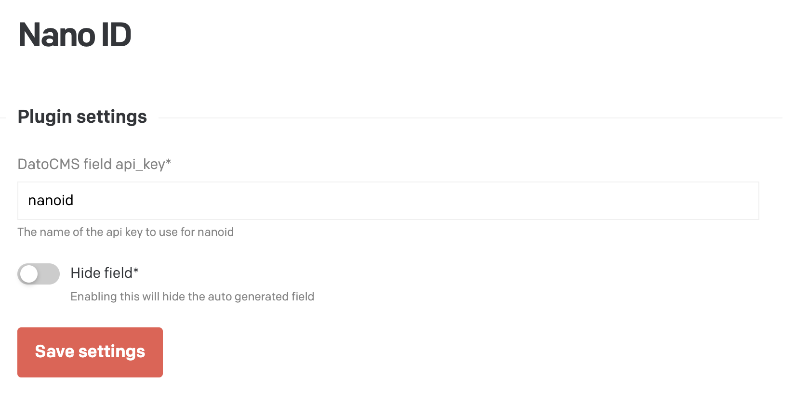
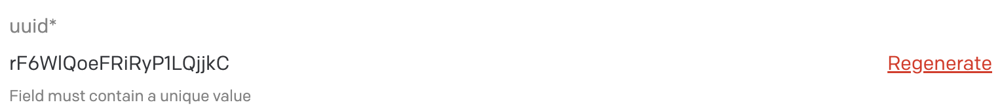

# Nano ID DatoCMS Plugin

Created by [November Five](https://www.novemberfive.co/)

Plugin that adds nanoid's to any field automatically. This allows to have unique references to a model across migrations. The editor doesn't have to do anything as the uuid field is hidden and automatically filled in with a random nanoid using the [nanoid](https://github.com/ai/nanoid).

## Configuration

After installing the plugin, you'll need to configure the plugin settings:

You can specify the `api_key` of the field that will be automatically converted to a hidden "`nanoid`" field. A good name is `nanoid`, then add a single line string field to a model and call it `nanoid`.

The `hide field` option by default is turned on, if you turn it off the field is displayed and you can regenerate the id.

## Development

If you want to develop on this extension, the quickest way is to run `yarn start` and manually install it by going to Settings > Plugins,
clicking the add button, and clicking "create a private one" in the lower right. Give it:

- A name of your choosing
- An entry point URL of `http://localhost:3000`
